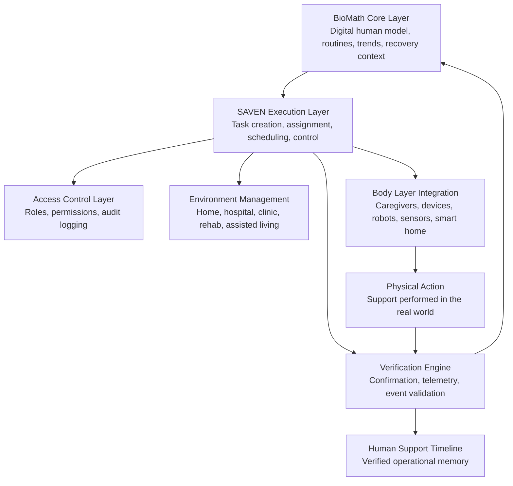
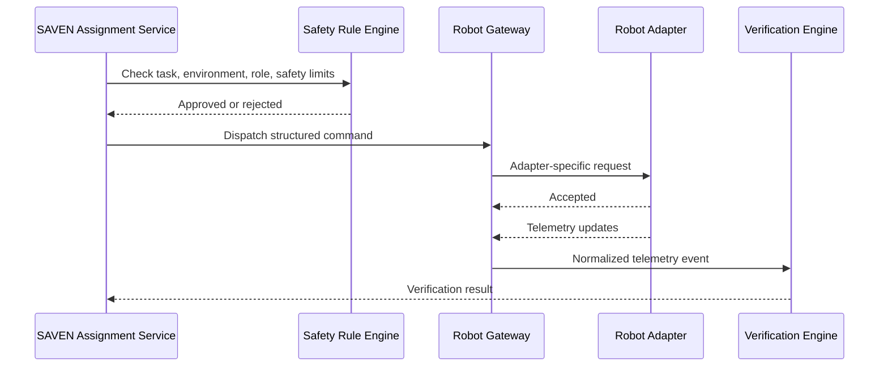
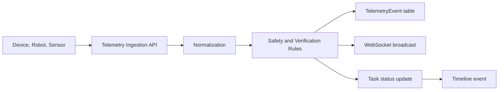
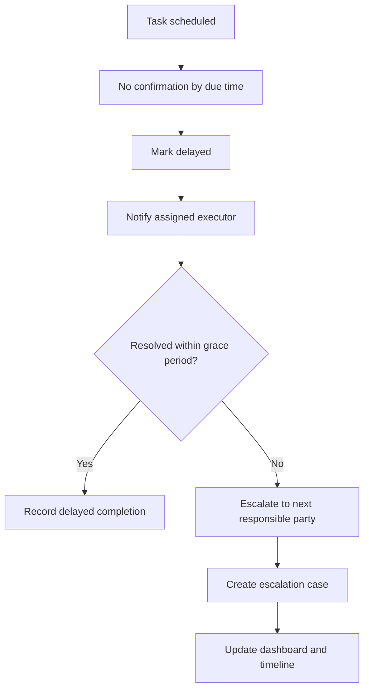

# SAVEN System Architecture

Project: SAVEN  
Environment: BioMath Core  
Target stack: Next.js, TypeScript, PostgreSQL, Prisma, Tailwind, REST API, WebSocket events  
Product role: Execution, verification, and human support infrastructure

## 1. Full SAVEN System Architecture

SAVEN is a deeply integrated execution layer inside the BioMath Core ecosystem. BioMath Core maintains the digital understanding of a person. SAVEN converts structured support signals into verified real-world support actions. Body Layer systems execute those actions through people, devices, sensors, smart environments, and future robotic assistants.

SAVEN is not a diagnosis engine, treatment engine, autonomous caregiver, emotional chatbot, or replacement for clinicians.

### System Layers



### Core Principles

- BioMath Core understands the person.
- SAVEN coordinates, assigns, verifies, and records support actions.
- Body Layer systems execute under SAVEN rules.
- Every meaningful action is logged.
- Every care-support action should have a verification path.
- Humans remain in the loop for sensitive decisions, exceptions, and escalation.

### High-Level Modules

- `Core Signal Gateway`: receives structured BioMath Core signals.
- `Task Orchestration Service`: converts signals into care/support tasks.
- `Assignment Service`: selects human, system, device, or robot executor.
- `Verification Engine`: validates completion through confirmations and telemetry.
- `Timeline Service`: stores verified execution history.
- `Care Graph Service`: maps people, systems, permissions, and environments.
- `Device Registry`: tracks capabilities, safety limits, status, and API endpoints.
- `Robot Gateway`: normalizes robot/device commands and telemetry.
- `Environment Manager`: manages rules, policies, permissions, and escalation paths.
- `RBAC Service`: controls access by role, task, environment, and time.
- `Telemetry Service`: streams real-time status and device events.
- `Escalation Service`: handles missed tasks, risk flags, and operational exceptions.
- `Audit Service`: stores immutable action history.

## 2. Frontend Structure

Target framework: Next.js App Router with TypeScript and Tailwind.

### Route Map

```text
app/
  layout.tsx
  page.tsx
  saven/
    layout.tsx
    page.tsx
    dashboard/page.tsx
    timeline/page.tsx
    care-graph/page.tsx
    tasks/page.tsx
    tasks/[taskId]/page.tsx
    environments/page.tsx
    environments/[environmentId]/page.tsx
    registry/page.tsx
    registry/devices/[deviceId]/page.tsx
    registry/robots/[robotId]/page.tsx
    access/page.tsx
    escalation/page.tsx
    settings/page.tsx
```

### Frontend Modules

```text
components/saven/
  SavenShell.tsx
  SavenSidebar.tsx
  SavenTopBar.tsx
  StatusPill.tsx
  PriorityBadge.tsx
  VerificationBadge.tsx
  TimelineEventCard.tsx
  CareGraphCanvas.tsx
  EnvironmentSwitcher.tsx
  DeviceStatusPanel.tsx
  RobotCapabilityPanel.tsx
  EscalationRail.tsx
  TaskComposer.tsx
  TaskDetailPanel.tsx
  LiveTelemetryStrip.tsx
  HumanConfirmationModal.tsx
```

### Frontend State

- Server data: React Query or Next.js server components with typed API clients.
- Real-time state: WebSocket client with event reducers.
- Local UI state: Zustand for sidebar, filters, selected environment, selected user.
- Form state: React Hook Form and Zod schemas.

### UI Direction

- Premium, calm, human-centered, low-stress.
- Apple/Tesla-inspired restraint: high precision, soft depth, minimal noise, confident spacing.
- Large typography for status and next actions.
- Soft gradients and quiet depth.
- Minimal visible borders, strong spacing, clear hierarchy.
- Future human support infrastructure, not a generic healthcare CRM.
- Robotics-ready execution platform, not traditional hospital software.
- Premium wellness and recovery ecosystem, not administrative back-office tooling.
- No traditional hospital dashboard look.
- No alarm-heavy red UI unless escalation is active and actionable.

## 3. Backend Services

Target runtime: Next.js route handlers for product API, plus optional separate workers for events and telemetry.

### Service Boundaries

```text
services/
  biomath-signal.service.ts
  care-task.service.ts
  assignment.service.ts
  verification.service.ts
  timeline.service.ts
  care-graph.service.ts
  device-registry.service.ts
  robot-gateway.service.ts
  environment.service.ts
  escalation.service.ts
  telemetry.service.ts
  access-control.service.ts
  audit-log.service.ts
  notification.service.ts
```

### Backend Responsibilities

- Receive BioMath Core support signals.
- Create structured support tasks.
- Assign tasks to human or Body Layer executors.
- Track status transitions.
- Verify completion.
- Ingest telemetry.
- Update Human Support Timeline.
- Enforce role and environment permissions.
- Escalate missed, delayed, failed, or high-risk tasks.
- Return verified results to BioMath Core.

## 4. PostgreSQL Schema

Use PostgreSQL with Prisma. Store operational data in normalized tables. Store telemetry payloads and event metadata as JSONB where the shape varies by device.

### Prisma Schema Draft

```prisma
enum ExecutorType {
  human
  device
  robot
  sensor
  system
}

enum TaskStatus {
  planned
  assigned
  accepted
  in_progress
  completed
  failed
  delayed
  escalated
  canceled
}

enum VerificationStatus {
  completed
  partial
  failed
  not_confirmed
  delayed
  exception
}

enum Priority {
  low
  normal
  high
  urgent
}

enum EnvironmentType {
  home
  hospital
  clinic
  rehabilitation_center
  assisted_living
  senior_care
}

model UserProfile {
  id                    String   @id @default(cuid())
  name                  String
  age                   Int?
  supportContext        String?
  mobilityStatus        String?
  primaryEnvironmentId  String?
  linkedBiomathModelId  String   @unique
  createdAt             DateTime @default(now())
  updatedAt             DateTime @updatedAt

  primaryEnvironment Environment? @relation(fields: [primaryEnvironmentId], references: [id])
  tasks              CareTask[]
  events             ExecutionEvent[]
  accessRoles        AccessRole[]
}

model CareTask {
  id                   String       @id @default(cuid())
  userId               String
  environmentId        String?
  source               String
  category             String
  priority             Priority     @default(normal)
  title                String
  description          String
  assignedExecutorId   String?
  executorType         ExecutorType
  scheduledTime        DateTime?
  dueAt                DateTime?
  status               TaskStatus   @default(planned)
  verificationRequired Boolean      @default(true)
  verificationMethod   String?
  escalationLevel      Int          @default(0)
  metadata             Json?
  createdAt            DateTime     @default(now())
  updatedAt            DateTime     @updatedAt

  user        UserProfile      @relation(fields: [userId], references: [id])
  environment Environment?     @relation(fields: [environmentId], references: [id])
  events      ExecutionEvent[]
  audits      AuditLog[]

  @@index([userId, status])
  @@index([scheduledTime])
  @@index([environmentId])
}

model ExecutionEvent {
  id                 String             @id @default(cuid())
  taskId             String
  userId             String
  executorId         String?
  eventType          String
  status             TaskStatus?
  verificationStatus VerificationStatus?
  telemetryPayload   Json?
  notes              String?
  timestamp          DateTime           @default(now())

  task CareTask    @relation(fields: [taskId], references: [id])
  user UserProfile @relation(fields: [userId], references: [id])

  @@index([taskId, timestamp])
  @@index([userId, timestamp])
}

model Environment {
  id                String          @id @default(cuid())
  name              String
  type              EnvironmentType
  safetyRules       Json?
  escalationRules   Json?
  operationalPolicy Json?
  createdAt         DateTime        @default(now())
  updatedAt         DateTime        @updatedAt

  users   UserProfile[]
  tasks   CareTask[]
  devices DeviceProfile[]
  robots  RobotProfile[]
}

model DeviceProfile {
  id             String   @id @default(cuid())
  environmentId  String?
  name           String
  type           String
  manufacturer   String?
  capabilities   Json
  apiEndpoint    String?
  safetyLimits   Json?
  status         String   @default("offline")
  lastSeenAt     DateTime?
  createdAt      DateTime @default(now())
  updatedAt      DateTime @updatedAt

  environment Environment? @relation(fields: [environmentId], references: [id])
}

model RobotProfile {
  id             String   @id @default(cuid())
  environmentId  String?
  model          String
  manufacturer   String?
  capabilities   Json
  safetyLimits   Json
  onlineStatus   String   @default("offline")
  apiEndpoint    String?
  lastSeenAt     DateTime?
  createdAt      DateTime @default(now())
  updatedAt      DateTime @updatedAt

  environment Environment? @relation(fields: [environmentId], references: [id])
}

model AccessRole {
  id               String   @id @default(cuid())
  userId           String
  actorId          String
  role             String
  permissions      Json
  environmentScope Json?
  expiresAt        DateTime?
  createdAt        DateTime @default(now())
  updatedAt        DateTime @updatedAt

  user UserProfile @relation(fields: [userId], references: [id])

  @@index([actorId, role])
  @@index([userId])
}

model TelemetryEvent {
  id            String   @id @default(cuid())
  sourceType    String
  sourceId      String
  userId        String?
  taskId        String?
  environmentId String?
  eventName     String
  payload       Json
  receivedAt    DateTime @default(now())

  @@index([sourceType, sourceId, receivedAt])
  @@index([taskId])
  @@index([userId, receivedAt])
}

model EscalationCase {
  id             String   @id @default(cuid())
  taskId          String
  userId          String
  level           Int      @default(1)
  reason          String
  status          String   @default("open")
  assignedActorId String?
  openedAt        DateTime @default(now())
  resolvedAt      DateTime?
  metadata        Json?

  @@index([taskId])
  @@index([userId, status])
}

model AuditLog {
  id          String   @id @default(cuid())
  actorId     String?
  userId      String?
  taskId      String?
  action      String
  entityType  String
  entityId    String
  before      Json?
  after       Json?
  ipAddress   String?
  userAgent   String?
  createdAt   DateTime @default(now())

  task CareTask? @relation(fields: [taskId], references: [id])

  @@index([entityType, entityId])
  @@index([actorId, createdAt])
}
```

## 5. API Endpoints

Use REST for transactional operations and WebSocket events for live state.

### BioMath Core Signal API

```text
POST   /api/saven/signals
GET    /api/saven/signals/:signalId
```

Purpose: receive structured support signals from BioMath Core.

Example request:

```json
{
  "linkedBiomathModelId": "bm_123",
  "category": "hydration",
  "priority": "normal",
  "recommendedAction": "Offer hydration support",
  "timeWindow": {
    "start": "2026-05-19T18:00:00.000Z",
    "end": "2026-05-19T19:00:00.000Z"
  },
  "context": {
    "environment": "home",
    "reason": "Routine hydration interval"
  }
}
```

### Task API

```text
GET    /api/saven/tasks
POST   /api/saven/tasks
GET    /api/saven/tasks/:taskId
PATCH  /api/saven/tasks/:taskId
POST   /api/saven/tasks/:taskId/assign
POST   /api/saven/tasks/:taskId/accept
POST   /api/saven/tasks/:taskId/start
POST   /api/saven/tasks/:taskId/complete
POST   /api/saven/tasks/:taskId/skip
POST   /api/saven/tasks/:taskId/escalate
```

### Verification API

```text
POST   /api/saven/tasks/:taskId/verify
GET    /api/saven/tasks/:taskId/verification
POST   /api/saven/verification/events
```

### Timeline API

```text
GET    /api/saven/users/:userId/timeline
GET    /api/saven/users/:userId/timeline/summary
```

### Care Graph API

```text
GET    /api/saven/users/:userId/care-graph
POST   /api/saven/users/:userId/care-graph/links
PATCH  /api/saven/users/:userId/care-graph/links/:linkId
DELETE /api/saven/users/:userId/care-graph/links/:linkId
```

### Registry API

```text
GET    /api/saven/devices
POST   /api/saven/devices
GET    /api/saven/devices/:deviceId
PATCH  /api/saven/devices/:deviceId
POST   /api/saven/devices/:deviceId/ping

GET    /api/saven/robots
POST   /api/saven/robots
GET    /api/saven/robots/:robotId
PATCH  /api/saven/robots/:robotId
POST   /api/saven/robots/:robotId/ping
```

### Environment API

```text
GET    /api/saven/environments
POST   /api/saven/environments
GET    /api/saven/environments/:environmentId
PATCH  /api/saven/environments/:environmentId
GET    /api/saven/environments/:environmentId/rules
PATCH  /api/saven/environments/:environmentId/rules
```

### Access Control API

```text
GET    /api/saven/users/:userId/access
POST   /api/saven/users/:userId/access
PATCH  /api/saven/users/:userId/access/:roleId
DELETE /api/saven/users/:userId/access/:roleId
```

### Telemetry API

```text
POST   /api/saven/telemetry
GET    /api/saven/telemetry
GET    /api/saven/telemetry/sources/:sourceId
```

## 6. Event-Driven Architecture

SAVEN should treat execution as a stream of operational events. REST creates and changes durable records. WebSocket events keep the interface alive.

### Event Bus Topics

```text
biomath.signal.received
task.created
task.assigned
task.accepted
task.started
task.completed
task.failed
task.delayed
task.escalated
verification.received
verification.completed
verification.exception
telemetry.received
device.online
device.offline
robot.online
robot.offline
environment.rule.changed
access.role.changed
audit.logged
timeline.event.created
```

### Event Envelope

```ts
export type SavenEvent<TPayload> = {
  id: string;
  name: string;
  version: 1;
  timestamp: string;
  actorId?: string;
  userId?: string;
  taskId?: string;
  environmentId?: string;
  source: 'biomath-core' | 'saven' | 'device' | 'robot' | 'sensor' | 'caregiver-app';
  payload: TPayload;
};
```

### WebSocket Channels

```text
/ws/saven/users/:userId
/ws/saven/tasks/:taskId
/ws/saven/environments/:environmentId
/ws/saven/registry
/ws/saven/admin
```

### Client Event Handling

- `task.created`: add task to dashboard.
- `task.delayed`: move task to attention rail.
- `verification.completed`: update status, append timeline event.
- `telemetry.received`: update device panel and live strip.
- `robot.offline`: show quiet operational warning, not panic UI.
- `escalation.created`: show responsible party and next action.

## 7. Robot and Device Integration Layer

The integration layer must normalize different device APIs into one SAVEN command and telemetry model.

### Integration Principles

- Devices and robots do not decide care plans.
- Devices receive structured tasks and return status.
- Safety rules are checked before dispatch.
- Capability matching happens before assignment.
- Sensitive tasks require human oversight.
- All actions are auditable.

### Command Model

```ts
export type BodyLayerCommand = {
  commandId: string;
  taskId: string;
  executorId: string;
  executorType: 'device' | 'robot' | 'sensor' | 'system';
  capability: string;
  action: string;
  parameters: Record<string, unknown>;
  safetyLimits: Record<string, unknown>;
  environmentId: string;
  expiresAt: string;
};
```

### Device Adapter Interface

```ts
export interface BodyLayerAdapter {
  executorId: string;
  capabilities(): Promise<string[]>;
  health(): Promise<{ online: boolean; battery?: number; status: string }>;
  canExecute(command: BodyLayerCommand): Promise<boolean>;
  dispatch(command: BodyLayerCommand): Promise<{ accepted: boolean; reason?: string }>;
  normalizeTelemetry(payload: unknown): Promise<NormalizedTelemetryEvent>;
}
```

### Robot Gateway Flow



## 8. Verification Engine

The verification engine is the core trust mechanism. SAVEN must verify execution, not assume it.

### Verification Inputs

- User confirmation.
- Caregiver confirmation.
- Clinician or support provider confirmation.
- Sensor event.
- Wearable telemetry.
- Robot telemetry.
- Device telemetry.
- Smart environment event.
- System rule evaluation.

### Verification Decision Model

```ts
export type VerificationDecision = {
  taskId: string;
  status: 'completed' | 'partial' | 'failed' | 'not_confirmed' | 'delayed' | 'exception';
  confidence: number;
  sources: Array<{
    sourceType: 'human' | 'device' | 'robot' | 'sensor' | 'system';
    sourceId: string;
    evidenceType: string;
    payload?: Record<string, unknown>;
  }>;
  requiresHumanReview: boolean;
  notes?: string;
};
```

### Verification Rules

- Manual confirmation can complete low-risk support tasks.
- Device telemetry can complete device-performed tasks if the source is trusted.
- Robot telemetry can verify accepted, started, completed, failed, or blocked states.
- Conflicting evidence creates an exception.
- Missing evidence creates `not_confirmed`.
- Late evidence can update a delayed task but must preserve the delay event.

## 9. Role-Based Access Model

Access must be scoped by role, environment, task, and time.

### Roles

```text
user
family
caregiver
clinician
support_provider
robot_operator
environment_admin
system_admin
```

### Permission Groups

```text
task:read
task:create
task:assign
task:update_status
task:verify
task:escalate
timeline:read
timeline:comment
care_graph:read
care_graph:manage
device:read
device:manage
robot:read
robot:operate
environment:read
environment:manage_rules
access:read
access:manage
audit:read
```

### Access Policy Example

```ts
export type AccessPolicy = {
  actorId: string;
  role: string;
  permissions: string[];
  userScope: string[];
  environmentScope: string[];
  taskCategories?: string[];
  expiresAt?: string;
};
```

### Required Checks

- Who is the actor?
- What user profile is being accessed?
- Which environment is active?
- What task category is involved?
- Is the action allowed for the role?
- Has the role expired?
- Does the task require higher approval?

## 10. Real-Time Telemetry System

Telemetry should support live operational clarity without overwhelming users.

### Telemetry Pipeline



### Telemetry Event Shape

```ts
export type NormalizedTelemetryEvent = {
  sourceType: 'device' | 'robot' | 'sensor' | 'wearable' | 'environment';
  sourceId: string;
  eventName: string;
  userId?: string;
  taskId?: string;
  environmentId?: string;
  timestamp: string;
  payload: {
    status?: string;
    battery?: number;
    signal?: number;
    locationZone?: string;
    measurement?: Record<string, number | string>;
    errorCode?: string;
  };
};
```

### UI Telemetry Rules

- Show only useful live status in the main dashboard.
- Push technical payloads into detail panels.
- Use calm language: `Needs attention`, `Waiting for confirmation`, `Device offline`.
- Avoid alarm language unless escalation is active.

## 11. Human Support Timeline UI

The timeline is SAVEN's operational memory.

### Layout

- Left column: date and time grouping.
- Main column: verified support events.
- Right rail: filters, verification source, environment.
- Detail drawer: evidence, notes, telemetry payload, audit trail.

### Timeline Event Card

```text
[Verified] Hydration support completed
Today, 10:25 AM
Confirmed by caregiver
Environment: Home
Related task: Morning hydration support
```

### Filters

- All support events.
- Completed.
- Delayed.
- Escalated.
- Human confirmed.
- Device confirmed.
- Robot confirmed.
- Environment.
- Task category.

### Visual Style

- Spacious cards.
- Soft vertical rhythm.
- Calm blue, graphite, warm gold accents.
- No dense hospital table layout.

## 12. Care Graph UI

Care Graph maps relationships around the person.

### Nodes

- User.
- Family.
- Caregivers.
- Clinicians.
- Support providers.
- Robots.
- Devices.
- Sensors.
- Environments.

### Edges

- Has access to.
- Assigned to.
- Verifies.
- Escalates to.
- Operates in.
- Sends telemetry.

### Interaction

- Click a node to open a clean detail panel.
- Toggle role visibility.
- Toggle environment scope.
- Show escalation paths.
- Show responsibility chain for a selected task.

### UI Direction

The graph should feel like an elegant support constellation, not a technical network monitor.

## 13. Dashboard UI

The dashboard is the main operational overview.

### Top-Level Dashboard Areas

- Current support status.
- Active tasks.
- Delayed tasks.
- Completed actions.
- Device status.
- Robot status.
- Caregiver status.
- Environment alerts.
- Wellness continuity indicators.

### Layout

```text
SAVEN Dashboard
  Top status band
    Current person, environment, support state
  Primary grid
    Active support tasks
    Needs attention
    Verified today
  Secondary grid
    Device and robot readiness
    Caregiver availability
    Environment continuity
  Timeline preview
    Latest verified support actions
```

### Dashboard Copy Style

- `Support is active`
- `Two tasks need confirmation`
- `Home environment connected`
- `Caregiver handoff complete`
- `Robot assistant online`
- `Waiting for verification`

## 14. Smart Escalation Workflows

Escalation must feel calm and operational. It should make responsibility clear.

### Missed Task Workflow



### Escalation Levels

- Level 1: assigned executor reminder.
- Level 2: family or caregiver supervisor notification.
- Level 3: environment admin or support provider review.
- Level 4: urgent support protocol, if configured.

### Escalation Rules

- Rules are environment-specific.
- Rules can differ by task category and priority.
- Escalation must preserve event history.
- Escalation must not claim diagnosis or treatment.
- Emergency workflows should route to configured responsible humans or services.

## 15. Environment Management System

Environment Management keeps one SAVEN logic across home, hospital recovery, clinic, rehabilitation center, assisted living, and senior care.

### Environment Model

Each environment defines:

- Name and type.
- Active users.
- Connected devices.
- Available robots.
- Human support roles.
- Safety rules.
- Escalation rules.
- Operational policies.
- Task category permissions.
- Allowed verification methods.

### Environment Modes

```text
Home
  Autonomy, routine, family support, smart home devices

Hospital Recovery
  Transition, discharge support, tighter oversight, recovery routines

Clinic
  Scheduled support, professional review, limited device scope

Rehabilitation Center
  Exercise support, progress verification, mobility routines

Assisted Living
  Shift handoffs, shared staff, accountability record

Senior Care
  Long-term continuity, family visibility, environment policies
```

### Environment-Aware Task Assignment

```ts
export type EnvironmentRuleResult = {
  allowed: boolean;
  reason?: string;
  requiredExecutorType?: 'human' | 'device' | 'robot' | 'system';
  requiredVerificationMethod?: string;
  escalationPath?: string[];
};
```

### Environment UI

- Environment cards with calm status.
- Connected systems list.
- Safety rules summary.
- Escalation path preview.
- Handoff history.
- Active policies.

## Implementation Phases

### Phase 1: Operational Foundation

- Next.js SAVEN shell.
- Dashboard UI.
- Task model and task API.
- Manual verification.
- Human Support Timeline.
- Role-based access.
- Audit logs.

### Phase 2: BioMath Core Integration

- Core Signal Gateway.
- Signal-to-task conversion.
- Recommendation rules.
- Environment-aware assignment.
- Timeline feedback to BioMath Core.

### Phase 3: Device and Telemetry Layer

- Device Registry.
- Telemetry ingestion.
- WebSocket live updates.
- Verification from trusted telemetry.
- Device health panels.

### Phase 4: Robot-Ready Execution

- Robot profiles.
- Robot Gateway.
- Adapter interface.
- Safety rule preflight.
- Robot telemetry verification.
- Human review for sensitive actions.

### Phase 5: Advanced Continuity

- Smart escalation automation.
- Multi-environment handoff.
- Predictive support workflows.
- Care Graph intelligence.
- Reporting and operational analytics.

## Product Positioning Rules

Use this language:

- Human support infrastructure.
- Care coordination.
- Task execution.
- Verified support actions.
- Operational continuity.
- Recovery routines.
- Daily assistance.
- Robotics-ready execution platform.

Avoid this language:

- Diagnosis.
- Treatment engine.
- Autonomous medical decision-making.
- Replacement for clinicians.
- AI caregiver.
- Emotional companion chatbot.
- Sci-fi robot system.

## Main Product Statement

SAVEN connects BioMath Core's digital understanding of a person with verified real-world support actions performed by people, devices, environments, and future robotic systems.
